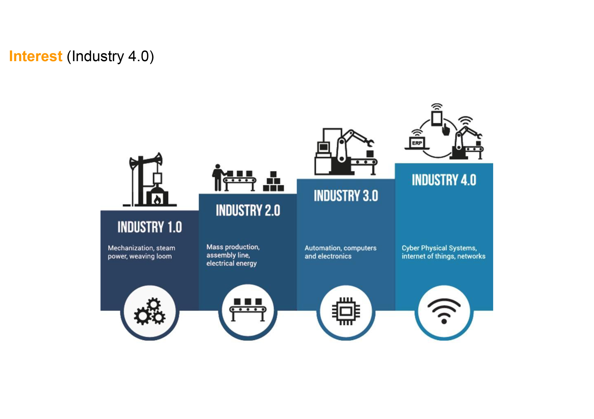
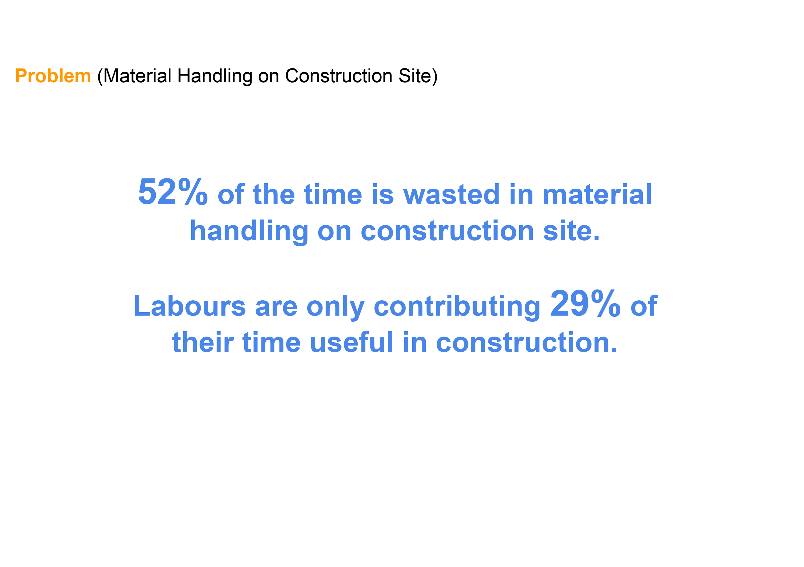
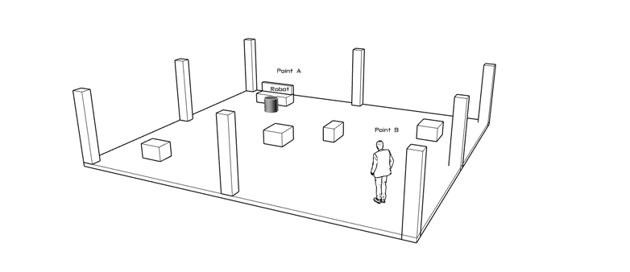
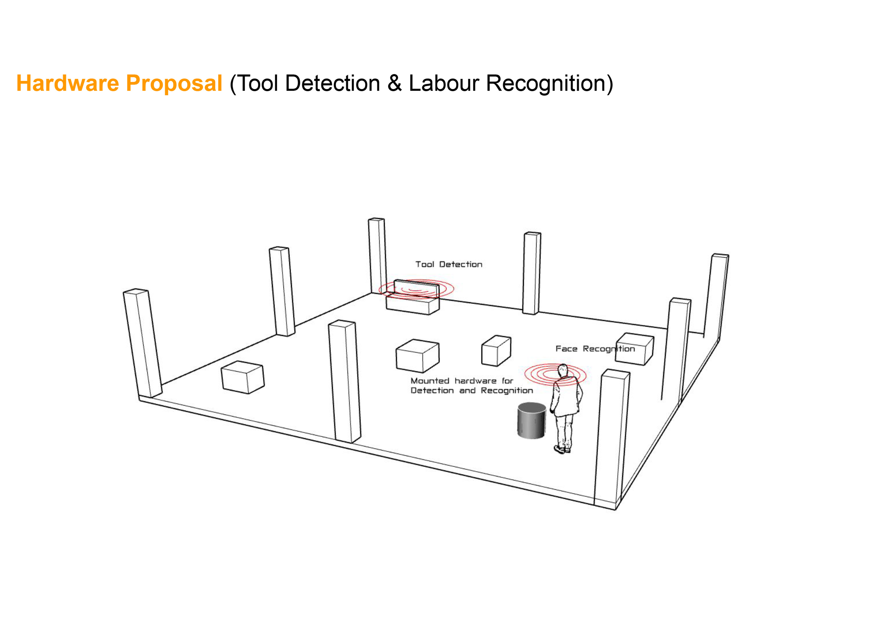
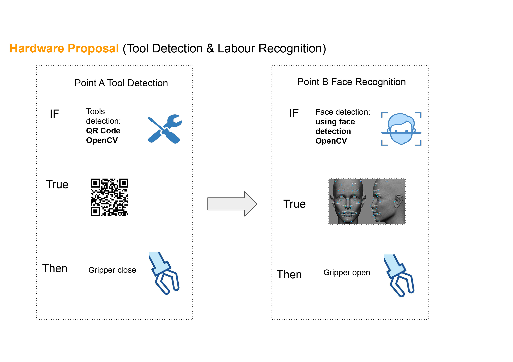
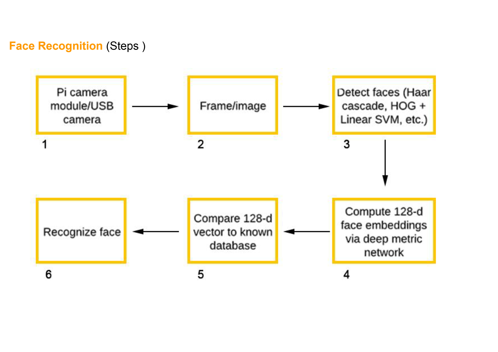
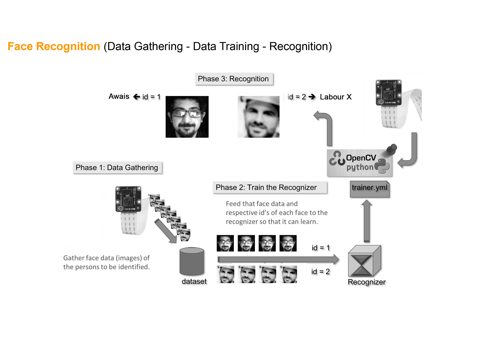

 
 # Automated assistance for small tools and materials 
 
 This project started as a research about how to improve time and material resources in construction sites.
 Based on previous researchs, is possible to find construction workers can only contribute  with 29% or their time productive labor. Rest of the working time
 is wasted in material waiting, tool waiting, material handling and movement.
 
 How improve working time and help to increase production rates?
  
   
 
 ## Requirements 
 
 -Raspberry pi 4 
 -Gripper with servo motor 
 -Raspberry camera
 -OpenCV phyton 
 -Zbar code reader 
  
  
  
 ## Getting started 
 Analizing the actual behaviour in construction sites, we designed a protocol for tool demand and deliver.
 
 
 First install OpenCV on Raspberry Pi and the libraries for face recognition and servo: haarcascade_frontal_face, Raspberry pi drivers for Raspberry camera,dlib, OS libraries.
 
 
 
 ## Demo 2 Face Recognition and gripper open/close
 In this diagrams is possible to see process of the different steps done.
 Construct gripper using rhino file and cut it with laser cut machine 
 Do the connection between Raspberry camera and Raspberry pi, and the servo with the board.
 Use the camera to detect faces and recognize it, when the detection is possitive the gripper is moving. 
 .gif)
 
 
 
 
